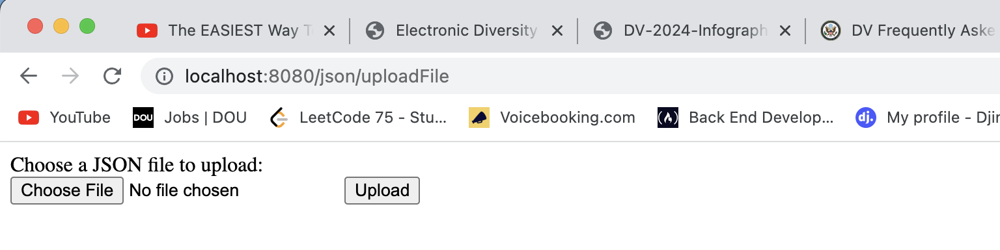
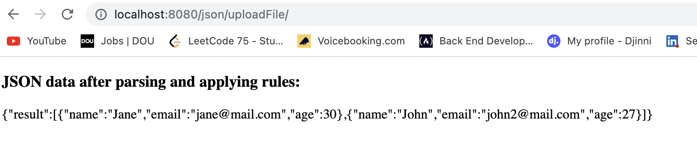
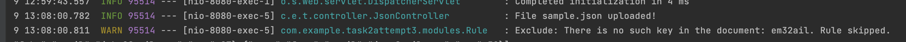
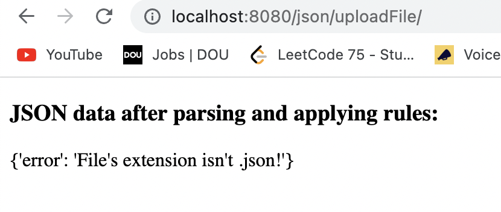
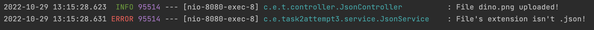
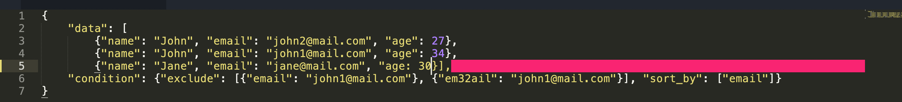
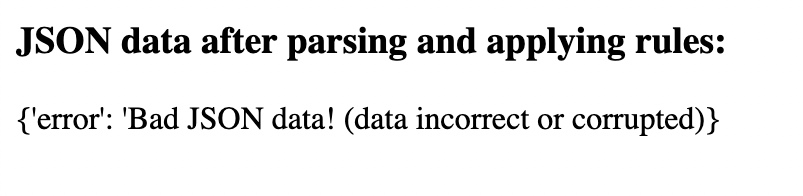
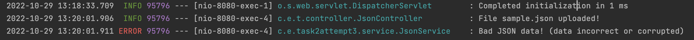
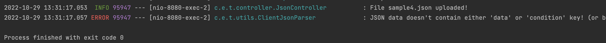

### How to work with this application.

Go to the root directory of the project and type ```./mvnw spring-boot:run```.

Go to localhost:8080/json/uploadFile - you will be redirected to the page for file uploading.



Hit the *Choose File* button and select the JSON file that has the structure like below:
```
{
    "data": [{json data}, {json data}],
    "condition": {
        "include": [include rules],
        "sort_by": [keys to sort by],
        etc ...
    }
}
```
For example:
```
{
	"data": [
		{"name": "John", "email": "john2@mail.com", "age": 27},
		{"name": "John", "email": "john1@mail.com", "age": 34},
		{"name": "Jane", "email": "jane@mail.com", "age": 30}],
	"condition": {
	    "exclude": [{"email": "john1@mail.com"}, {"em32ail": "john2@mail.com"}],
	    "sort_by": ["email"]
	}
}
```

Click the *Upload* button. If you did everything properly, you will be redirected to the same endpoint (/json/uploadFile)
and provided with the screen with the result.



We've excluded JSON data that stores key-value pair {"email": "john1@mail.com"}, and sorted all the data by email
("sort_by": ["email"]). Notice, that I specifically added the wrong key in the *exclude* rule ("em32ail"). Since
there is no such key in the JSON document, we skipped it. You can see an appropriate message in the console logs:



The same happen in any other cases when we specify the key that isn't present in the document when applying any rule.

What if you upload not a .json file? - You will see appropriate messages:




What if you upload corrupted .json file? (in which json data has an incorrect structure) - You will see appropriate messages:

Missing square bracket:



Result of uploading:




All the uploading files are being saved in the *uploadedClientFiles* directory (yep, it's not suitable for production,
but in this case it's quite usable).

If you upload a JSON file that has the right structure, but doesn't contain either "data" or "condition" key, the app
will shut down, and you will receive an appropriate message in the console logs:



Basically, it's built to read JSON files (generally, JSON data, but in this case, we're uploading this data in files),
extract necessary keys such as "data" (that stores data itself), "condition" (stores the rules that should be applied
to extracted data.), apply passed rules and return the result of the execution.
Rules in turn can be added as independent modules into the application. Each rule must extend an abstract class
called Rule that stores a logger object and an abstract method applyRule(JSONObject document, JSONObject rule).

So, each applyRule() method of the rule object accepts the JSON document (data) as the first parameter,
and the rule that must be applied to this data and returns an updated JSON data after applying the rules.

### How to add new modules?

All the modules are stored in the "modules" package. The naming pattern looks like this: ModuleNameRule.class

Say, you want to add a new module to apply the rule that limits the number of returned JSON objects in the result.
This module can be named as LimitRule.class. This module **must** extend the Rule abstract class.

After you implemented the logic of the module itself, you should connect it in the ClientJsonParser class.
- Add ```private Object limitRule``` row.
- In the ```public ClientJsonParser(JSONObject clientJsonData)``` constructor, add:
```
if (condition.containsKey("limit")) {
    this.limitRule = condition.get("limit");
    listOfRules.put("limit", limitRule);
}
```
- Then, in the ```public JSONObject applyRulesToJsonData()```, add the if() statement inside of ```listOfRules.forEach((ruleName, rule) -> ...```:
```
if (ruleName.equals("limit")) {
    LimitRule limit = new LimitRule();
    JSONObject dataToLimit = new JSONData();
    dataToLimit.put("data", satisfyingData);
    JSONObject limitRuleWrapper = new JSONObject();
    limitRuleWrapper.put("limit", (JSONObject) listOfRules.get("limit"));
    JSONArray jsonArrayWrapper = new JSONArray();
    for (Object object : (JSONArray) limit.applyRule(dataToLimit, limitRuleWrapper).get("data")) {
        jsonArrayWrapper.add(object);
    }
    satisfyingData = jsonArrayWrapper;
}
```

That's it. **It's important to notice that each application logic of a particular rule in the ClientJsonParser is going
to vary from one another.** It's so because of difference of the conceptual idea of work of each rule.

For example, in IncludeRule we have to go through each key-value pair in the "include" condition and apply it
step by step to the initial document and append each result of the application to updated (resulting) data.

For ExcludeRule, we have to go through each key-value pair in the "exclude" condition and apply it step by step to the
updated (resulting) data.

For SortBy rule, we have to go through each key to sort by in the "sort_by" condition and return the sorted updated
document each time.

For LimitRule, we have limit the number of JSON objects returned from the updated JSON data once and return it.

Issues:
- SortByRule works only partially (program can sort the data only by one key. If you specify two or more keys,
program overwrites the document each time and returns the result sorted by the last specified key).